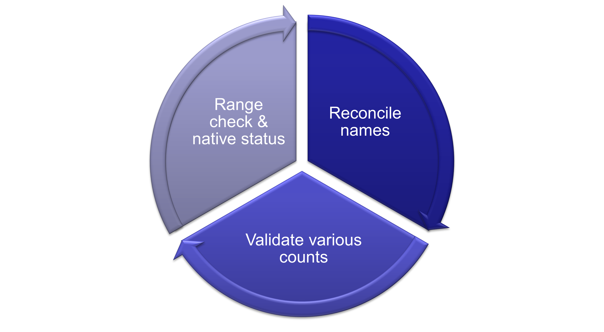

National Rivers and Stream Assessment Fish Assemblage Quality Assurance
Procedure (DRAFT)
================
Darin Kopp, Richard Mitchell, Louis Reynolds, and Dave Peck
2024-10-24

<figure>

<figcaption aria-hidden="true">Components of the quality assurance
procedure for fish assemblages</figcaption>
</figure>

## 1) Name Reconciliation

• Fish are identified in the field. Through the app, crews are given
common name options from a drop-down menu or can enter the name manually
if the taxon has not been recorded in the NRSA database.

• All names for taxa identified in the field must have a matching name
in the NRSA Fish autecology file. • QA Check: Taxon names assigned in
the field could be misspelled or ambiguous.

#### Procedure:

• Reconcile names - Merge NAME_COM with FINAL_NAME from NRSA Taxa List

o Check “Unknown” or unidentified taxa against UNKNOWNS in FINAL_NAME
using grep

 Can these be resolved with voucher specimens?

o Check NAME_COM against most similar taxa listed in FINAL_NAME using

 Corrected obvious spelling errors

o Compare NAME_COM with taxa previously collected from the state during
1819 NRSA survey. Given an ambiguous taxon (i.e. NAME_COM could
potentially be joined with two names in the NRSA autecology files), if
the taxon was collected from the state previously, assume that is the
correct name for the ambiguous taxa.

o Compare NAME_COM to AFS accepted common names (see:
Names-of-Fishes-8-Table1.pdf). If the common name assigned in the field
is also accepted by AFS these taxa are added as new records in NRSA
autecology

o Identify instances where NAME_COM is different from FINAL_NAME and
confirm the name change is appropriate.

R-script: “Reconcile_Names.R”

Files produced:

Reconciled_Taxa_Names.csv – List of record with TAXA_ID assignments from
NRSA Autecology dataset

Check_Taxa_NRSA_Reconciled_Names_2023.csv – List of records with
different NAME_COM and FINAL_NAMES

## 2) Range Checks and Nativeness

• Fish names assigned in the field could misidentified or non-native.
Often field crews do not indicate whether a taxon is introduced. Native
status is used to calculate MMI and assigned at the HUC8 scale.

• QA Check: Compare fish collected and identified in the field with
native range shapefiles provided by NatureServe and the non-indigenous
aquatic species (NAS) database from USGS.

### Procedure:

• Each site needs to be assigned a HUC8. Some handpicked sites may be
missing a HUC8 assignment but this will be fixed with site.info file is
finalized.

• For each species, query NatureServe shapefiles stored locally:
“L:/Public/dpeck/NRSA 2018-19 FISH DATA CLEANUP/NATURESERVE FISH
DISTRIBUTION SHAPEFILES 2020/Shapefiles”, non-native records from NAS
and previous NRSA surveys to obtain a list of HUC8 where species is
either native, non-native, or collected previously.

o API query stalls on a few taxa which will have to be searched
manually. NAS API is also very slow. Consider making a “master list”
that contains all HUC8 records for species collected by NRSA.

o When a HUC was surveyed during a previous cycle, assign the
native/non-native designation. This is essentially leveraging expert
opinion from previous NRSA (i.e. Dave Peck et al.)

• Compare list of HUC8’s with the HUC8 of the 2324 site where the taxon
was collected and assign native if HUC8 was included in NatureServe
Database or Non-native if HUC8 was included in NAS

o In some cases, a species can be assigned both native and non-native
because of conflicting sources/information or maybe species could be
non-native in some streams within the HUC8 but native in others. I think
we should handle these as “all or nothing” if it is non-native anywhere
in the HUC8 it should be designated as non-native.

• If a HUC8 was not surveyed by a previous survey or included in
NatureServe or NAS, aggregate to the HUC6 level, and compare again.

o This will list all HUC8’s that are nested within a HUC 6 and tally the
records. Typically, taxa in neighboring HUC8s are all either Non-native
or native but we’ll have to handle conflicting assignments.

• If no records were provided for HUC6 aggregation, then used the
INTRODUCED column value given by field crew.

• Manually check taxa that were unmatched and/or have conflicting
assignments.

o Unmatched taxa could be due to a name change between shapefile and
scientific name. In the future explore options to harmonize names to
most recent accepted name.

R-script: Range_Check.R

## 3) Evaluate Fish Info and Sampling sufficiency (In Progress)

• Ensure methods are appropriate for the stream width. • Determine
sampling sufficiency: number of individuals collected, or percent of
reach fished. R-script: In Progress
