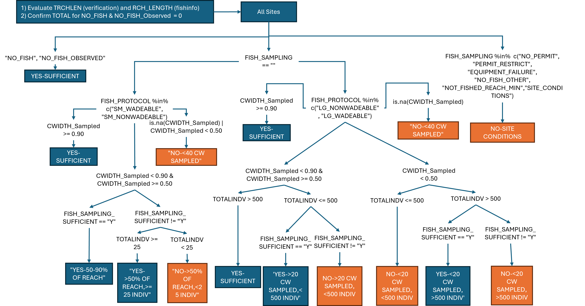

National Rivers and Stream Assessment Fish Assemblage Quality Assurance
Procedure 2023-2024 (Draft)
================
Darin Kopp, Richard Mitchell, Louis Reynolds, and Dave Peck
3-31-2025

Background: Beginning in 2008-2009, the United States Environmental
Protection Agency, in collaboration with states and tribes, conducts the
National Rivers and Streams Assessment (See [Technical
Reports](https://www.epa.gov/national-aquatic-resource-surveys/national-rivers-and-streams-assessment-2018-19-technical-support)
and [Field and Laboratory
Manuals](https://www.epa.gov/national-aquatic-resource-surveys/manuals-used-national-aquatic-resource-surveys#National%20Rivers%20&%20Streams%20Assessment)
and
[Reports](https://www.epa.gov/national-aquatic-resource-surveys/national-rivers-and-streams-assessment-2018-19-results)).
Fish assemblages are surveyed during the assessment because they are a
key indicator of biological integrity and water quality. During the
2023-2024 cycle approximately 95 field crews surveyed fish assemblages
at about 1,800 locations. This document outlines a semi-automated QA/QC
procedure that efficiently identifies and corrects inconsistencies or
errors in the data and ensures they are of the highest quality for use
in biological assessment (Figure 1).

 Name Reconciliation: The
name reconciliation module harmonizes field identifications with the
NRSA taxa list. Field crews are provided with taxa names maintained by
NRSA in the field application prior to sampling but are permitted to
enter new species manually. Typing names in the field can be prone to
spelling mistakes. This module uses a fuzzy matching routine to identify
and correct spelling errors. When a specimen cannot be successfully
identified in the field, it is preserved and transported back to the
laboratory for identification. Identification can take several weeks to
months to complete. During the QA/QC field crews were contacted to
comment on any identifications that were unknown or not easily
reconciled because of spelling or abbreviated names. If the field crew
indicated that updates were made, corrections are added to NARS IM. Any
taxa that were not collected during a previous survey are added to the
NRSA taxa list along with their autecology information.

Taxonomist check: At a predetermined sub sample of sites, QA voucher
specimens (photos or preserved) are collected and used to evaluate the
proficiency of the field taxonomists. These samples should contain
specimens that representative of all species collected at the site. The
specimens are labeled in the field and then shipped to an independent
taxonomist for evaluation. Because specimens are manually labeled in the
field, it is complicates matching between the lab field and lab
identifications. Often field crews use line number in place of Tag,
other instances the tag is incorrectly recorded. Care was taken to
successfully match identifications, often on a site-by-site basis. Any
inconsistent identifications are sent back to QC taxonomist for
comments. If the QC taxonomist was confident in their identification,
the name assigned in the field was corrected in the fish collection
file.

Range and Nativeness Checks: Since majority of taxa are released in the
field, comparing a record collected during NRSA to published ranges can
elucidate instances where field identification may be incorrect or the
presence of a non-native taxa. As part of the 2324 survey we compiled
native ranges at the HUC8 level from NAS, NATURESERVE, PiSCES and
previous NRSA surveys. This taxa list will be managed similarly to the
autecology file, where new occurrence records collected in future
surveys will be appended to the list. This will improve consistency in
native/non-native designations. The table was created by leveraging the
nested hydrologic unit codes. For example if a species occurrence in a
HUC8 was not recorded in any of the existing dataset, records were
aggregated to the HUC6 - assuming that the nearby designations within a
larger Hydrologic Unit represent the status in the new HUC. When an
occurrence and HUC could not be matched, nativeness was assessed by
searching state wildlife agency websites or other appropriate sources.

Sampling sufficiency: NRSA supports 4 protocols for fish sampling to
accommodate differences in sampling reach width. For small wadeable
streams (\<= 12m), sample the entire reach (150m or 40 channel widths);
for large wadeable, sample until 500 individuals are collected with a
minimum of length of 20CW. Protocols for small and large non-wadeable
streams are similar to wadeable. The objective for the sampling
sufficiency module is to ensure that sampling efforts were consistent
with the protocol outlined in the Field Manual. For condition estimates
to be valid the sampled assemblage needs to be is representative of the
entire community. Data collected from streams that were not sufficiently
sampled for fish cannot be used to assess stream condition based on the
fish assemblage. The module consists of a series of Boolean statements,
which account for the length fished, the number of individuals collected
and the site conditions (including permit restrictions). The categories
assigned are consistent with previous surveys and balances input from
field crew, total reach length, reach length fished and number of
individuals collected. Instances where there was disagreement between
the assignment and the value (Y/N) reported by the crews were checked
manually. Typically, the sufficiency value recorded by the field crew
was given priority.

<figure>

<figcaption aria-hidden="true">Decision Tree documenting the Sampling
Designations for NRSA 2023-24 fish assemblages</figcaption>
</figure>

Multimetric Index calculation: The multimetric index was developed using
data collected from previous NRSA surveys (i.e. 2008-2009 and 2013-2014)
and used to calculate scores for 2018-2019 and 2023-2024. The
development of the Fish MMI is documented in the \[technical support
document\]
(<https://www.epa.gov/national-aquatic-resource-surveys/national-rivers-and-streams-assessment-2018-19-technical-support>).
Candidate metrics were grouped into grouped into several dimensions that
represent assemblage structure and function: Nonnative species,
taxonomic composition, species richness, habitat guild, life history,
reproductive guild, trophic guild and tolerance.
